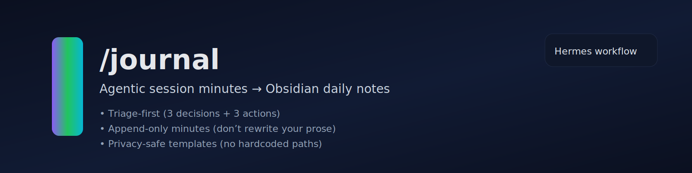
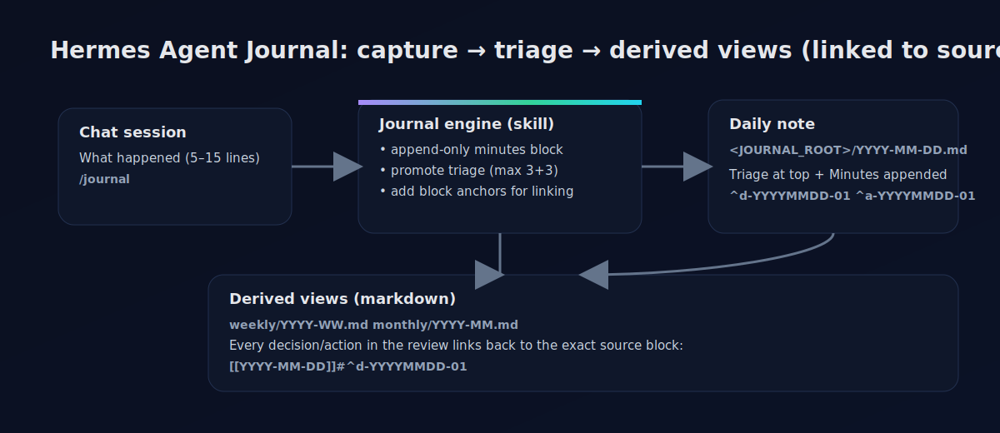

# Hermes Agent Journal — backend-optional /journal (privacy-safe)

Community package for Hermes Agent: triage-first session minutes into local markdown (flat files by default).

This folder is a *public-shareable* packaging of the “agentic journaling / session minutes” workflow.

Design goals:
- Local-first: you own the artifacts (Obsidian is an optional preset, not a dependency)
- Triage-first: keep a small, current top section (Decisions + Next actions)
- Append-only minutes: add new “session minutes” blocks, do not rewrite your prose
- Backend-optional: flat files, Obsidian, JSONL now; SQLite/Postgres/canvas planned
- Privacy-safe by default: templates avoid absolute paths, names, emails, and other PII

## What’s included

- `skill/` — publishable skill template (`journal`), backend-optional (flat files default; Obsidian preset)
- `examples/` — synthetic/redacted daily-note examples
- `docs/` — options tree, feature matrix, proposal, UX spec, privacy, export/redaction
- `templates/` — daily note templates
- `schemas/` — JSON schema for JSONL/event backends
- `marketing/` — banner/social card assets (SVG)

## Quickstart

1) Install Hermes Agent
- https://hermes-agent.nousresearch.com/docs

2) Install the skill (local)
- Copy `skill/SKILL.md` to: `~/.hermes/skills/note-taking/journal/SKILL.md`

3) Set your journal root (private)
- Choose a folder path for your daily notes, then set it via:
  - private fork: replace `<JOURNAL_ROOT>` in your local skill file, OR
  - memory: tell Hermes once: `My journal root is: /abs/path/to/journal`

4) Use it
- In a Hermes session: type `/journal` and paste 5–15 lines of what happened.

More details: `docs/INSTALL.md`

## Safety boundaries (summary)

- Do not export raw daily notes.
- Do not embed absolute paths, emails, phone numbers, addresses, or private identifiers in any public doc.
- In examples, use placeholders like:
  - `<JOURNAL_ROOT>`
  - `<PROJECT_ROOT>`
  - `<LINK>`
  - `<PERSON>`
  - `<ID>`

## License

MIT — see `LICENSE`.
